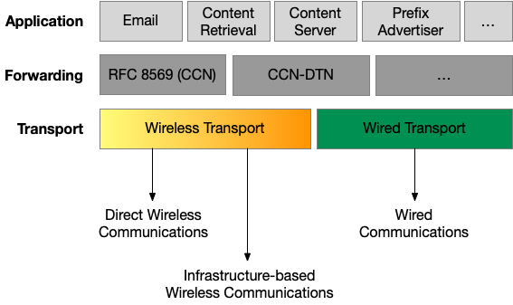
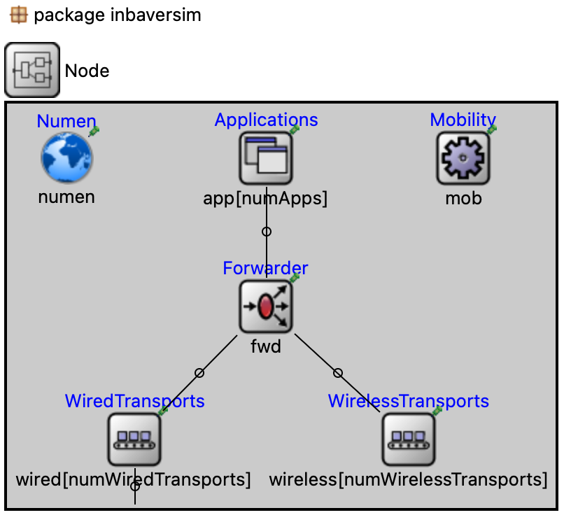
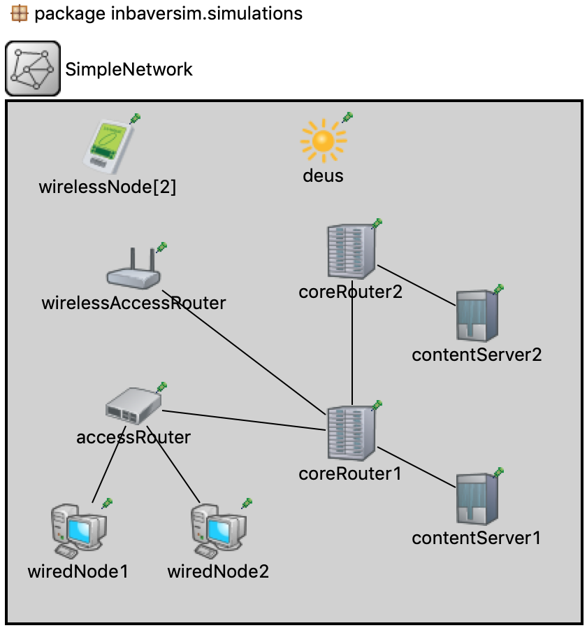
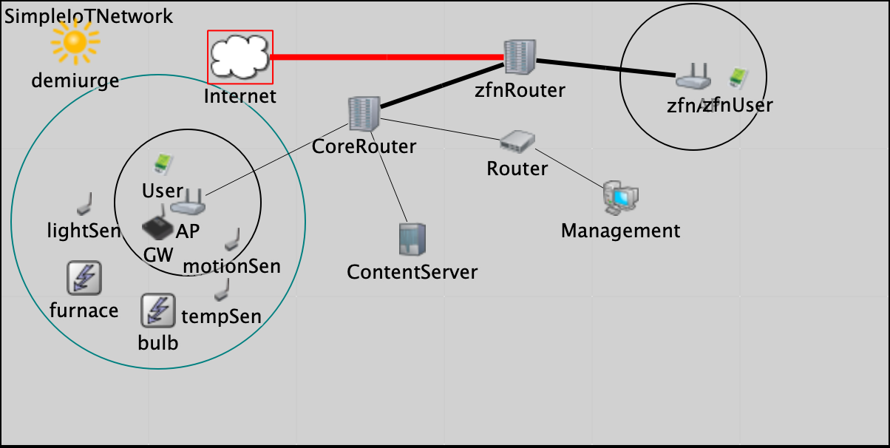
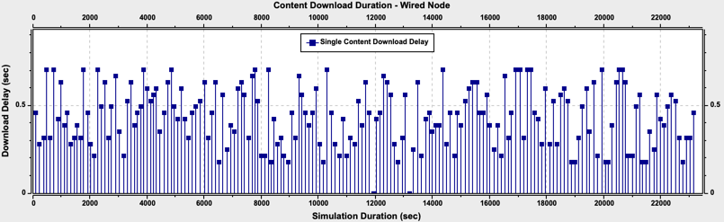
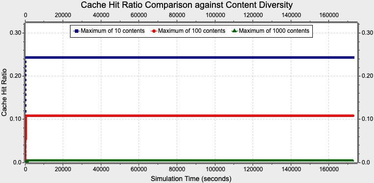

  

Network use has evolved over time to be dominated by content distribution and retrieval, while 
networking technology is mainly concerned with connections between named hosts. Accessing 
contents and services require the mapping of what users care about to where the content is 
located. **Content Centric Networking (CCN)** is a new paradigm in networking and a future Internet 
architecture which treats content as the primitive - decoupling location from identity, security 
and access - to retrieve content by name. 

**inbaverSim** is an OMNeT++ based model framework to simulate CCN based networks. The functionality and 
the message formats follow the description provided in [RFC 8569](https://tools.ietf.org/html/rfc8569) 
and [RFC 8609](https://tools.ietf.org/html/rfc8609). An overview to the model framework is provided
in the publication
[inbaverSim: An OMNeT++ Model Framework for Content Centric Networking](https://summit.omnetpp.org/2021/assets/pdf/OMNeT_2021_paper_12.pdf)

The sections that follow provide details of **inbaverSim** such as installing, node architecture, etc. 
The text immediately below is a TL;DR summary of how to install and run simulations with **inbaverSim**.

1. Install the latest version of [OMNeT++](https://omnetpp.org/documentation/)
2. Run the OMNeT++ IDE and install the INET model framework
3. Build the INET model framework in mode
4. Import **inbaverSim** repository (this respository) by cloning from [GitHub inbaverSim](https://github.com/ComNets-Bremen/inbaverSim.git)
5. Build **inbaverSim** project
6. Run simulations using the `omnetpp-simple-network.ini`

## Node Models

**inbaverSim** is able to model the operation of different types of CCN nodes and networks. A list of
node types are given below. 

- **Wireless Nodes** - Nodes that are able to connect to infrastructure based wireless networks (e.g., WLAN, LTE)
- **Wireless Access Routers** - Routers that are access points/base stations for wireless nodes
- **DTN/OppNets Nodes** - Wireless nodes that employ direct communications between nodes
- **Wired Nodes** - Nodes connected to networks over wired network attachments
- **Access Routers** - Routers for wired network nodes
- **Core Routers** - Central CCN routers that connect other networks
- **Content Servers** - Servers that host content
- **Wireless Sensor Nodes** - Wireless sensor nodes deployed with sensors (temperature, humidity, etc.)
- **IOT Gateways** - Gateways connecting wireless sensor networks and the Internet
- **Internet** - Node simulating a CCN based Internet where the behaviour of many nodes and applications are deployed

The picture below shows the topology of a CCN network with all the above nodes.

  

## Protocol Stack 

The node architecture of an **inbaverSim** node of any type consist of a 3-layer protoclol 
stack as seen from the following picture.

  

- **Application**: All CCN based applications are deployed at this layer
- **Forwarding**: The fowarding mechanism described in [RFC 8569](https://tools.ietf.org/html/rfc8569) or 
 other custom CCN forwarding mechanism is implemented at this layer (e.g., DTN, IoT)
- **Transport**: This layer implements different transports that connect nodes to deliver CCN packets. 
Currently, two transports are supported - conceptual wired and wireless transports 

The picture below shows the **inbaverSim** node model architecture in OMNeT++.

  

## Installing

**inbaverSim** is written for OMNeT++ and additionally uses the INET model framework of 
OMNeT++. Therefore, they have to be installed first to use **inbaverSim**. The 
installation procedure is as follows.

1. Install OMNeT++ - OMNeT provides an [Install Guilde](https://doc.omnetpp.org/omnetpp/InstallGuide.pdf) 
to install OMNeT++ in different operating systems.

2. Install INET Model Framework - Installing is done through the OMNeT++ IDE. The steps are as follows.
  - Run the OMNeT++ IDE
  - Create a new workspace
  - After creating the workspace, the IDE will prompt asking to install INET
  - Once the INET code base is installed, rebuild INET in `release` mode

3. Install **inbaverSim** and build as follows.
  - Import the code from the [GitHub](https://github.com/ComNets-Bremen/inbaverSim.git) repositorty
  - Adjust project properties (`Project References` and `C/C++ General->Paths and Symbols`)
  - Build **inbaverSim**

If there are problems when building the model, check [FAQ](./res/info/FAQ.md)

## Running Simulations

The `simulation` folder has sample `.ini` files to run simulations. The procedure of running
a simulation is given below.

1. Setup the `'.ini` file to run simulations as follows.
  - Select a sample `.ini` file from `simulations` folder
  - Open file by double clicking
  - Add/adjust parameters as required (e.g., change `sim-time-limit` to a different duration)

2. Run the simulation as follows.
  - Select `.ini` file
  - Right-click and click on `Run As`->`OMNeT++ Simulation`
  - Select the `Config name` in the new window that will pop up
  - Select the `Run` button to run the simulation

The pictures below shows two different CCN networks created to simulate.The first 
picture shows a simple CCN network that includes wireless and wired nodes
connected to a network with CCN infrastructure (routers and content servers)

  

The second network is similar to the first one but with connections to CCN based 
sensor networks.

  

## Statistics

Every simulation creates statistics during the simulation run. These statistics 
are collected in the `simulations/results` folder. Use the results viewing
capability of the OMNeT++ IDE to view the results.

The graph below shows the content download delays of a single node during a 48-hour 
period.

  

The graph below shows the network-wide cache hit ratio during a 48-hour 
period.

  

Details about each statistic is listed in [STATS](./res/info/STATS.md).

## Questions and Comments

If you have any questions or comments about **inbaverSim**, write to us at 
inbaverSim@comnets.uni-bremen.de

