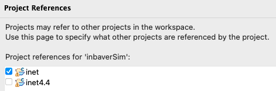
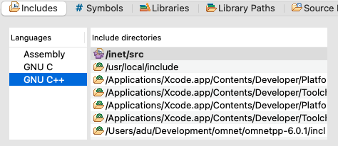

# Frequently Asked Questions and Known Problems

Sometimes, installing, building or simulating with inbaverSim does not proceed as expected. Here are 
some known problems and solutions to them.


## IMobility.h Not Found

### Problem

The following error appears terminating the buildiung process.

```
In file included from ./Demiurge.h:14:
./inbaver.h:7:10: fatal error: 'inet/mobility/contract/IMobility.h' file not found
#include "inet/mobility/contract/IMobility.h"
         ^~~~~~~~~~~~~~~~~~~~~~~~~~~~~~~~~~~~
```

The error says that the file `inet/mobility/contract/IMobility.h` cannot be found. 

### Solution

The `inet/mobility/contract/IMobility.h` file belongs to the INET model framework. When installing 
INET, the name is appended with the version number. Here are some examples.

- INET version 4.4.1 is installed as `inet4.4`
- INET version 4.3.9 is installed as `inet4.3`

There are a few places where references are made to the INET model framework in the `Properties`
part of the project.

1. The installed INET is ticked in the `Project References` section of the `Properties`
window.

<p align="center">
  
</p>


2. In `C/C++ General`->`Paths and Symbols` and `includes` tab, the path to the installed INET is
set properly. This must be done for the `C++` and `C` listed in `language` part. For example, if INET folder 
is `inet`, then the path must be `/inet/src`

<p align="center">
  
</p>

